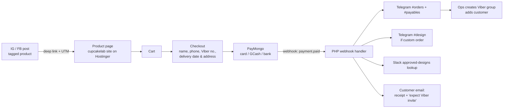

# Cupcake Lab PH — Ecommerce Website Plan

**Goal:** Turn Instagram/Facebook engagement into paid, trackable orders. A post or story leads the customer to the website, where they customize, pay (card / bank / GCash via PayMongo), and get looped into a per-order Viber group — while the ops team gets everything routed automatically into Telegram (MCJC workspace) and Slack.

---

## 1. Recommended architecture

| Layer | Choice | Why |
|---|---|---|
| Hosting | **Hostinger Business shared hosting** (hPanel, PHP + MySQL, free SSL, daily backups) | ~US$3–4/mo promo, the mockup already lives on Hostinger so migration is trivial |
| Storefront | **WordPress + WooCommerce**, custom theme rebuilt from the freelancer's mockup | Free, runs perfectly on Hostinger shared hosting, mature order management, and PayMongo publishes an **official WooCommerce plugin** |
| Payments | **PayMongo** (official WooCommerce plugin + webhooks) | Your existing account; supports cards, GCash, Maya/GrabPay, and bank transfer (BPI/UnionBank direct online banking, QRPh) |
| Social bridge | **Meta catalog sync** (Facebook for WooCommerce plugin) + UTM deep links | Lets you tag products in IG/FB posts; taps land on the exact product page |
| Ops glue | **Small PHP webhook handler on the same Hostinger account** | PayMongo webhook → Telegram Bot API + Slack incoming webhook + email. No Zapier/Make subscription needed |
| Customer channel | **Viber group per order** (manual create, automated prompt) | Viber's API cannot create groups programmatically — see §6 for the honest workflow |

Why not a fully custom app: WooCommerce gives inventory, order states, refunds, discount codes, and an admin the team can use on day one, for ₱0 in licensing. The mockup becomes the theme, so the site still looks like *your* site, not a template.

---

## 2. Customer journey (end to end)

**Stage 1 — Discover (IG/FB).**
Every post/reel/story carries a product tag (via Meta catalog synced from WooCommerce) or a link: `cupcakelab.ph/product/red-velvet-box?utm_source=ig&utm_medium=post&utm_campaign=jul-launch`. Stories use link stickers; feed posts use tagged products + link in bio (Linktree-style page hosted on our own site: `cupcakelab.ph/links`). UTM parameters mean you can see in analytics exactly which post produced which sale.

**Stage 2 — Product page.**
Photos and copy from the mockup. Options per product: flavor, box size (e.g. 4/6/12), dedication/topper text, and for custom-design cupcakes an image-upload field + reference to the approved-designs gallery. Customer picks **fulfillment**: delivery (address + date, lead-time rules enforced, e.g. min 2 days ahead) or pickup (branch + time slot).

**Stage 3 — Cart & checkout.**
One-page checkout. Required fields: name, mobile number, **Viber number** (pre-filled from mobile, editable), email, delivery details. Delivery fee rules by city/zone or "Lalamove booked by us, quoted after confirmation" as a line item.

**Stage 4 — Payment (PayMongo).**
Customer chooses card, GCash, Maya/GrabPay, or bank transfer (BPI/UBP online banking or QRPh). Redirect/inline via the PayMongo plugin; 3DS handled by PayMongo. On success → order status `Processing`, stock decremented.

**Stage 5 — Confirmation.**
Thank-you page + email with order number, receipt, and the message: *"Your Cupcake Lab Viber group will be created within business hours — watch for an invite at 09xx-xxx-xxxx."*

**Stage 6 — Viber group.**
Ops receives the Telegram `#orders` card (see §6), creates the Viber group named `CL #1042 – <Customer> – <Date>`, adds the customer + relevant staff. All customer comms (design approvals, delivery updates, photos) happen there.

**Stage 7 — Fulfillment.**
Order flows through Telegram channels (production list, dispatch manifest, payables record). On the delivery day the dispatch update and rider photo go to the Viber group; `#photos` gets the finished product shot.

---

## 3. Hosting & running cost (economical)

| Item | Cost (approx) | Notes |
|---|---|---|
| Hostinger **Business** plan | ~US$3.99/mo on promo (renews higher — lock 24–48 mo) | PHP/MySQL, free SSL, daily backups, LiteSpeed cache, cron jobs, email accounts |
| Domain | Free .com first year with plan; `cupcakelab.ph` ≈ ₱1,000–1,500/yr if you want the .ph | Point existing mockup domain later |
| WordPress + WooCommerce + PayMongo plugin | ₱0 | Open source / free |
| Telegram bot, Slack webhook, Viber | ₱0 | Free APIs |
| PayMongo | Per-transaction only (no monthly fee) | See §4 |
| **Total fixed** | **≈ ₱250–450/month** | Everything else is % of sales |

The webhook handler, cron digests, and link-in-bio page all run on the same Hostinger account — no extra services.

*Alternative rejected:* Shopify (₱1,700+/mo + app fees) and Wix (limited PH payment support) both cost 5–10× more for the same outcome.

---

## 4. Payments — PayMongo integration

- **Plugin:** official *PayMongo for WooCommerce* — connect with your live secret/public keys. Test first with test keys in a staging subdomain (`staging.cupcakelab.ph`, free on Hostinger).
- **Methods enabled:** Credit/debit cards (with 3DS), **GCash**, Maya, GrabPay, **bank transfer** via BPI & UnionBank direct online banking and **QRPh** (scan-to-pay from any PH bank app — this is the practical "bank transfer" that confirms automatically, unlike manual InstaPay screenshots).
- **Indicative fees** (verify current rates at paymongo.com/pricing): cards ~3.5% + ₱15; GCash/e-wallets ~2.0–2.5%; online banking/QRPh ~1.5–2%. Payouts to your bank on PayMongo's standard schedule.
- **Webhooks:** subscribe to `payment.paid` and `payment.failed` → our PHP handler (signature-verified) marks the WooCommerce order and fans out notifications (§5). This kills the "did the GCash payment actually go through?" manual checking.
- **Refunds/partials** handled from the WooCommerce order screen through the plugin.

---

## 5. Ops notification routing (Telegram MCJC + Slack)

One Telegram bot (e.g. `@CupcakeLabOpsBot`) added as poster to the MCJC channels. Routing on events:

| Event | → Telegram channel | Content |
|---|---|---|
| Payment confirmed | **#orders** | Order card: number, items/flavors, dedication, delivery date/address, amount, payment method, **customer Viber number (tap-to-copy)** + "create Viber group" checklist |
| Payment confirmed | **#payables** | Amount, method, PayMongo fee, net, payout batch reference |
| Order contains custom design | **#design** | Design request + uploaded reference image + link to Slack approved-designs entry |
| Daily 6 AM cron | **#production** | Bake list for today+tomorrow (aggregated flavors/quantities) |
| Daily 6 AM cron | **#dispatch** | Delivery manifest: addresses, time windows, contact numbers |
| Daily 8 PM cron | **#general** | Digest: orders count, revenue, tomorrow's load |
| Corporate/bulk orders (flagged "CCI" in admin) | **#CCI orders** | Same order card, CCI-tagged |
| Finished-product shots uploaded by staff in admin | **#photos** | Image + order ref (also reusable for IG content) |

**Slack (approved designs repository):** a Slack incoming webhook posts each new custom-design request into your designs channel; conversely, the website's custom-order form shows a gallery synced from an "approved designs" folder (staff export approved designs from Slack into the site's media library — a lightweight weekly step, since Slack's API doesn't make a public gallery directly).

---

## 6. Viber — the honest constraint and the workflow

Viber's public API (bot/channel API) **cannot create group chats or add members programmatically**. No tool can fully automate "group created upon order confirmation." So the design is *automation-assisted manual*:

1. Payment confirmed → Telegram `#orders` card contains the customer's Viber number and a naming convention (`CL #1042 – Ana R. – Aug 2`).
2. Ops (rotating duty) creates the group from the Cupcake Lab Viber account, adds customer + CS + production lead. Target SLA: within 2 business hours (stated on the confirmation page so expectations match).
3. A canned welcome message template (stored in the Telegram card) is pasted in: order summary + timeline + who's who.

If you later want true automation, the fallback is a **Viber bot 1-on-1 thread** (customer taps a `viber://` deep link on the thank-you page to subscribe) — but that's a 1:1 chat, not a group. Recommend starting with the manual group flow since it matches how you operate today.

---

## 7. Build phases

| Phase | Scope | Est. effort |
|---|---|---|
| **1. Foundation** | Hostinger plan + domain, WordPress/WooCommerce install, staging subdomain, rebuild mockup as theme (products, photos, copy from the freelancer's site) | Week 1 |
| **2. Commerce** | Product options (flavors/box sizes/dedications), delivery/pickup rules & fees, PayMongo test-mode end-to-end, then live keys | Week 2 |
| **3. Ops wiring** | PayMongo webhook handler, Telegram bot + channel routing, Slack webhook, cron digests, Viber SOP + templates | Week 3 |
| **4. Social bridge & launch** | Meta catalog sync, product tagging on IG/FB, link-in-bio page, UTM convention, analytics (GA4 or Plausible), test orders with the team, go live | Week 4 |

## 8. What I need from you to start building

1. **Mockup access** — the staging URL is blocked by this session's network policy. Either allow `darkblue-locust-788234.hostingersite.com` in the session's network settings, or export the site files/images from Hostinger and drop them in this repo.
2. Hostinger account access (or I generate the site here and you upload), and the domain decision (`.ph` vs `.com`).
3. PayMongo **test** keys first; live keys at launch.
4. Telegram: create the bot via @BotFather, add it to the 8 MCJC channels, share the token + channel IDs.
5. Slack: an incoming-webhook URL for the approved-designs channel.
6. Product master list: flavors, box sizes, prices, lead times, delivery zones/fees, pickup branches.
